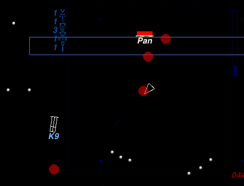
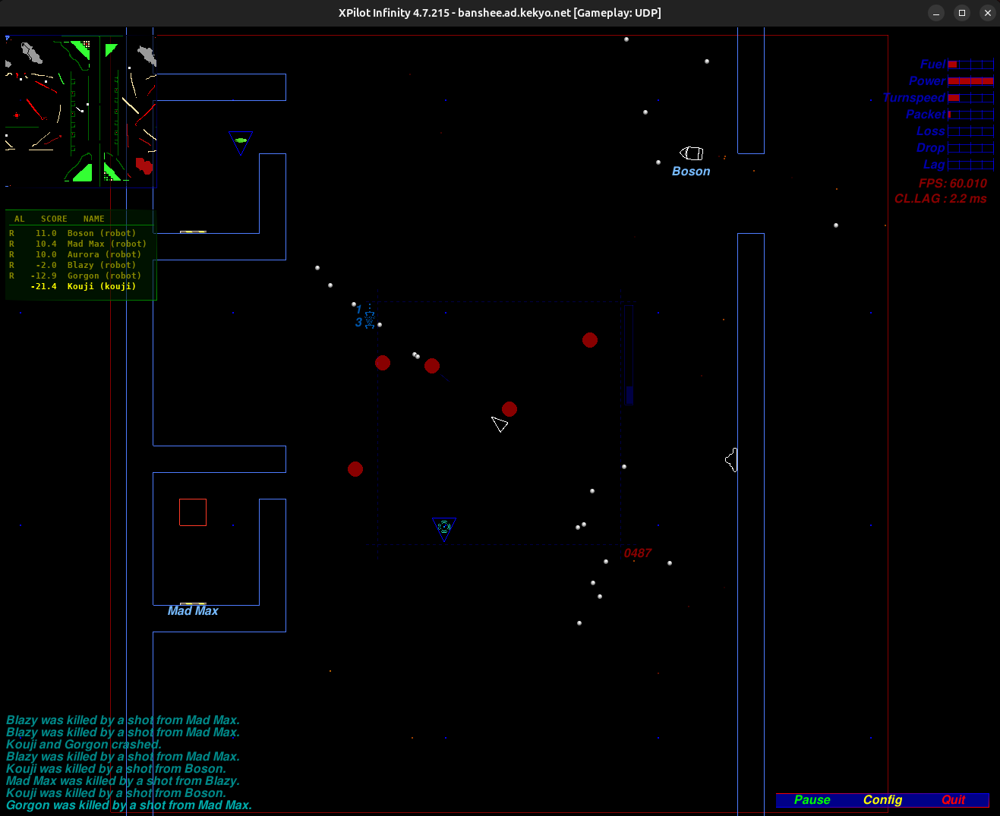
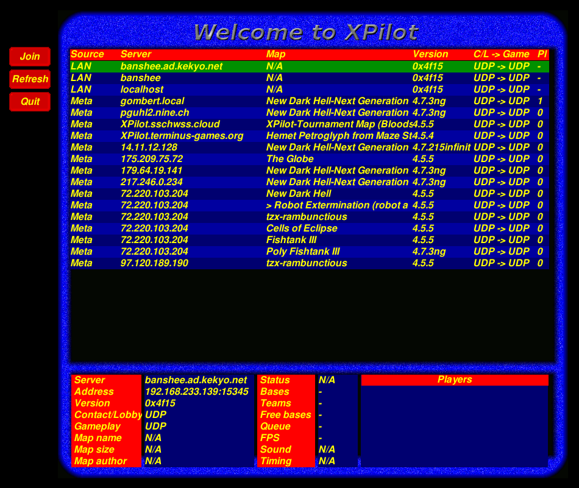

# XPilot Infinity

Multiplayer online space action since 1991.



Copyright © 1991-2005 by Bjørn Stabell, Ken Ronny Schouten, Bert Gijsbers,
Dick Balaska, Uoti Urpala, Juha Lindström, Kristian Söderblom and Erik
Andersson.

See [COPYING](COPYING) for further details. You may not distribute this
project without all the documentation, source code, and the COPYING file.

> XPilot Infinity was renamed from XPilot NG.
> XPilot Infinity develops and distributes on [xpilot-infinity repository](https://github.com/kekyo/xpilot-infinity/) .

[](https://www.repostatus.org/#active)

---

## What is this?

[From www.xpilot.org](https://www.xpilot.org/about/):

XPilot is a multi-player 2D space game. Some features are borrowed from classics like the Atari coin-ups Asteroids and Gravitar, and the home-computer games Thrust (Commodore 64) and Gravity Force (Commodore Amiga), but XPilot has many new aspects too.



Highlights include:

- True client/server based game; optimal speed for every player.
- Meta server with up to date information about servers hosting games around the world.
- A web of world-wide rating servers; compare your skills with pilots from all around the world, and climb the ladder of the world-wide rating list.
- 'Real physics'; particles of explosions and sparks from your engines all affect you if you're hit by them. This makes it possible to kill someone by lowing them into a wall with engine thrust or shock waves from explosions.
- Specialized editors for editing ship-shapes and maps.
- Game objective and gameplay adjustable through a number of options, specified on the commandline, in special option files, or in the map files. Examples f modes of the game:
  - classical dogfight; equipped with only your gun, you have to rely on your maneuvering and tactical skills
  - team; fight together, steal other teams's treasures (involves flying around with a ball in a string, much like in Thrust) and blow up their targets (which are, no doubt, heavily guarded)
  - all out nuclear war; chose carefully between more than twenty weapon and defense systems to stay alive and annihilate your enemies
  - race; make it through the deadly course before your opponents 
- Adjustable gravity; adjustable by putting special attractors or deflectors in the world, or by adjusting the global gravity in various ways.
- Cannons and personalized and vengeful robot fighters give you a hard time.
- Watch your energy, and remember to 'dock' with a fuel station to refuel before it's too late.
- Defend your home base, or terrorize and steal someone else's.
- Equip your ship with the 15+ defense and weapon systems: afterburners, cloaking devices, sensors, transporters, extra cannons, mines and bombs, rockets smarts, torpedos and nuclear), ECM, laser, extra tanks, autopilot etc.

## Installation and documentation

Available binary packages in [xpilot-infinity repository](https://github.com/kekyo/xpilot-infinity/releases/) .

The supported package matrix is:

| Distribution | Release | Architectures |
| :--- | :--- | :--- |
| Debian | bookworm | amd64, i386, arm64, armhf |
| Debian | trixie | amd64, i386, arm64, armhf, riscv64 |
| Ubuntu | 22.04 | amd64, arm64 |
| Ubuntu | 24.04 | amd64, arm64 |
| Ubuntu | 26.04 | amd64, arm64 |
| Windows | - | x86 (32bit), x86_64 (64bit) |

- Environment: SDL3, OpenGL 3.3 and OpenAL (sound)

The Debian and Ubuntu packages add **XPilot Infinity** to XDG-compatible
application menus. The launcher uses the packaged application icon and opens
the SDL server browser without additional arguments.

### Windows installation

Windows releases provide both an NSIS installer and a ZIP archive for each
architecture. For a normal installation, run the matching
`xpilot-infinity-<version>-windows-<architecture>-setup.exe`. It installs the
client, server, game data, and Start menu shortcut; selecting **XPilot
Infinity** from the Start menu opens the SDL server browser.

The ZIP archive remains the portable distribution. Extract it to any writable
directory and run `xpilot-infinity-sdl.exe` directly; installing the NSIS
package is not required for portable use.

Or, installation from source code instructions are in [INSTALL](INSTALL).

## Quick start the game

XPilot consists of a server program and a client program.
It is a multiplayer game in which multiple clients can connect to a single server.

First, start the server:

```bash
xpilot-infinity-server -noQuit
```

`-noQuit` is a parameter that keeps the server running even if all clients disconnect.
The same server process remains available.
To shut down the server, simply press Ctrl-C or similar.

While the server is running, just type it to show server list both local network and meta-server:

```bash
xpilot-infinity-sdl
```



You can connect to the server and start a game.

Or, connect server directly with the URL like:

```bash
xpilot-infinity-sdl udp://localhost
```

As indicated by the `udp://` URL, the UDP protocol is used.
You can also use TCP or WebSocket.

If you launch the SDL client without specifying a URL, it will query the
metaserver and perform one UDP discovery pass on the local network. The server
browser combines both result sets, identifies their source, and places LAN
servers first. You can disable the LAN query with `-localDiscovery no`.

There are still plenty of other features, but I can't cover them all here.

The documentation for XPilot Infinity is far from complete. For further reading, see the manuals in the [`doc/man`](doc/man) directory.

---

## Differences between XPilot NG and XPilot Infinity

XPilot Infinity's goal is to ensure that XPilot runs smoothly even in modern environments.
The main changes from NG version 4.7.3 are as follows:

- Added network protocols: TCP and WebSocket. This may make it easier to bypass routers and firewalls.
- Update to a modern graphics environment: Replaced with SDL3 and supported OpenGL 3.3 core profile.
- The internal structure has been slightly refactored.
  This was also essential to achieving the changes mentioned above.
  However, UDP protocol compatibility with version 4.7.3 has been maintained.
- Support for multilingual fonts via TTF in user name.
  For now, you should just install [Noto Sans Mono and families](https://fonts.google.com/noto/specimen/Noto+Sans+Mono).
- Sound engine is enabled.
- The Windows binaries have been modified to build using the MinGW toolchain.
- Debian packages (*.deb) can now be built for several architectures (using podman).

## Network transport

Contact/lobby and gameplay connections use UDP by default and can be selected
independently. To use TCP for both, start both endpoints with matching
settings, for example:

```console
xpilot-infinity-server -transport tcp [options]
xpilot-infinity-sdl -join tcp://server.example
```

Or use WebSocket for both:

```console
xpilot-infinity-server -websocket [options]
xpilot-infinity-sdl -join ws://server.example
```

The server shortcuts `-tcp`, `-udp`, `-websocket`, and
`-transport udp|tcp|websocket` select one transport for both contact/lobby and
gameplay. Command-line transport options are applied from left to right, so a
later `contactTransport` or `gameTransport` option can still create a split
UDP/TCP configuration. WebSocket must be selected for both transports.

Direct client targets accept `HOST`, `ws://HOST[:PORT]`,
`tcp://HOST[:PORT]`, or `udp://HOST[:PORT]`. A qualified target selects that
transport for both contact/lobby and gameplay, while a bare host uses the
`contactTransport`, `gameTransport`, and `port` option defaults. An explicit
target port overrides `-port`. Split UDP/TCP combinations remain available
through the long options or metaserver advertisements.

WebSocket uses RFC 6455 binary messages at `/xpilot` with the
`xpilot-infinity-v1` subprotocol; each message carries one logical XPilot
record. Only unencrypted `ws://` is currently implemented. The native clients
exercise this transport; browser client integration is intentionally a
separate step.

Multiple targets are tried in command-line order, for example
`ws://server1 tcp://server2 udp://server3`. This is explicit fallback between
targets; the client does not automatically probe multiple protocols for one
target. Target hosts are DNS names or IPv4 addresses. IPv6 literals and
general URI features such as credentials, paths, queries, fragments, and
percent encoding are not supported. TCP and WebSocket contact require an
explicit target or a metaserver entry because LAN broadcast discovery is
available only with UDP. With no explicit target, the SDL server browser makes
one UDP LAN discovery pass alongside its metaserver query. LAN and metaserver
results remain usable if the other query fails, and matching endpoint and
transport pairs are shown as one `LAN + Meta` entry. Use
`-localDiscovery no` to disable the LAN query.

If every explicit target fails to return a valid contact response after its
retries, the SDL client writes a final summary containing the last endpoint
and both selected transports to standard error. A normal graphical invocation
also displays the summary in one modal error dialog and exits unsuccessfully
after it is acknowledged. An explicit `-text` or `-list` invocation reports
through the terminal without opening that dialog. A server response used to
complete `-list`, or a later target that responds successfully, is not reported
as a connection failure.

Metaserver advertisements include both transport selections. The SDL and X11
clients apply the advertised values automatically when a server is selected;
legacy advertisements without transport metadata are treated as UDP contact
and UDP gameplay servers. Metaserver query and reporting traffic continues to
use its existing protocols.

The server's `clientPortStart` and `clientPortEnd` range applies to the
selected gameplay protocol. On clients it also applies to gameplay and the
traditional UDP contact socket; fixed TCP and WebSocket sessions use that
range for their local source port.

TCP gameplay records contain a two-byte network-order payload length followed
by an unchanged XPilot packet payload. Server recordings must be replayed with
the same `gameTransport` value that was used while recording.

### Running the server as a systemd service

The Debian and Ubuntu packages install an optional
`xpilot-infinity-server.service`. Installing the package does not start or
enable the service. To start it now and on subsequent boots, run:

```bash
sudo systemctl enable --now xpilot-infinity-server.service
```

The packaged service runs the `ndh.xp2` map continuously and does not advertise
itself to the public metaserver. Its default command-line options are stored in
`/etc/default/xpilot-infinity-server`. Edit `XPILOT_SERVER_OPTIONS` there to
select another map or configure other server options, then restart the service:

```bash
sudo systemctl restart xpilot-infinity-server.service
```

The configuration file uses systemd `EnvironmentFile` syntax rather than shell
syntax. Replace `+reportMeta` with `-reportMeta` only when the server should be
advertised publicly. Relative output files such as recordings are written
below `/var/lib/xpilot-infinity-server`.

Check the current status and follow the server log with:

```bash
systemctl status xpilot-infinity-server.service
journalctl -u xpilot-infinity-server.service -f
```

To stop the server and prevent it from starting on future boots, run:

```bash
sudo systemctl disable --now xpilot-infinity-server.service
```

### Running the server as a Windows service

On the installer's component page, optionally select **Dedicated server
service (manual start)**. The component is not selected for a new
installation. When selected, it registers `XPilotInfinityServer` with startup
type **Manual** under the `LocalService` account, but the installer does not
start it. Installing with the default component selection does not register a
service.

Open an elevated Command Prompt or PowerShell window to start and stop the
registered server manually:

```bat
sc.exe start XPilotInfinityServer
sc.exe stop XPilotInfinityServer
```

To enable startup on subsequent Windows boots, change its startup type to
automatic. This command alone does not start it in the current session:

```bat
sc.exe config XPilotInfinityServer start= auto
sc.exe start XPilotInfinityServer
```

Return it to manual startup with:

```bat
sc.exe stop XPilotInfinityServer
sc.exe config XPilotInfinityServer start= demand
```

The server configuration and log are stored under
`%ProgramData%\XPilot Infinity\server`. The default configuration runs
`ndh.xp2` continuously without advertising it to the public metaserver. Edit
`xpilot-infinity-server.conf` before starting the service to change those
settings. Upgrades and uninstallation preserve this directory; the
uninstaller stops and removes the service itself.

For an unattended installation, `/S` selects the normal client/server files
only. Add `/SERVER_SERVICE=1` to register the optional service. If `/D` is used
to override the install directory, NSIS requires it to be the final argument:

```bat
xpilot-infinity-setup.exe /S /SERVER_SERVICE=1 /D=C:\Games\XPilotInfinity
```

### Running the server with Podman

The repository contains a multi-stage [`Dockerfile`](Dockerfile) for the
dedicated server. The runtime image contains the server, the standard maps and
configuration data, and only its required shared libraries. It runs as
UID/GID `10001:10001`; its default command starts `ndh.xp2` on TCP port 15345
without reporting to the public metaserver.

Images published from this repository use
`docker.io/kekyo/xpilot-infinity-server`. To build a local image instead, run:

```bash
image=localhost/xpilot-infinity-server:local
./build_container_image.sh --tag "$image"
```

The build command uses Podman and never pushes an image. Release and
multi-architecture build instructions are in
[`doc/PACKAGING.md`](doc/PACKAGING.md#dedicated-server-container-image).

Create a named volume for recordings or other relative output files, then
start the default TCP server with a read-only root filesystem and no Linux
capabilities:

```bash
image=docker.io/kekyo/xpilot-infinity-server:latest
podman volume create xpilot-infinity-server-data
podman run --detach \
  --name xpilot-infinity-server \
  --read-only \
  --cap-drop=all \
  --security-opt=no-new-privileges \
  --publish 15345:15345/tcp \
  --volume \
    xpilot-infinity-server-data:/var/lib/xpilot-infinity-server \
  "$image"
```

Bind the published port to `127.0.0.1` instead when only local clients should
reach it. A remote client connects to the default container with:

```bash
xpilot-infinity-sdl tcp://server.example:15345
```

Arguments after the image name replace the image's default server arguments.
Repeat `-noQuit`, `+reportMeta`, the map, and `-tcp` when adding options. For
example, a custom defaults file and map can be mounted read-only:

```bash
podman run --detach \
  --name xpilot-infinity-server \
  --read-only --cap-drop=all \
  --security-opt=no-new-privileges \
  --publish 15345:15345/tcp \
  --volume "$PWD/defaults.txt:/etc/xpilot/defaults.txt:ro" \
  --volume "$PWD/my-map.xp2:/maps/my-map.xp2:ro" \
  --volume \
    xpilot-infinity-server-data:/var/lib/xpilot-infinity-server \
  "$image" \
  -noQuit +reportMeta -tcp \
  -defaultsFileName /etc/xpilot/defaults.txt \
  -map /maps/my-map.xp2
```

On SELinux hosts, add the appropriate `z` or `Z` relabel option to host bind
mounts. The bundled maps can be selected by basename without a mount.

Keep the operator password outside the image and source tree. Create a file in
the format described by [`lib/password.txt`](lib/password.txt), import it as a
Podman secret, and mount it for the image's non-root user:

```bash
podman secret create xpilot-server-password ./password.txt
podman run --detach \
  --name xpilot-infinity-server \
  --read-only --cap-drop=all \
  --security-opt=no-new-privileges \
  --publish 15345:15345/tcp \
  --volume \
    xpilot-infinity-server-data:/var/lib/xpilot-infinity-server \
  --secret \
    source=xpilot-server-password,target=xpilot-password,uid=10001,gid=10001,mode=0400 \
  "$image" \
  -noQuit +reportMeta -map ndh.xp2 -tcp \
  -passwordFileName /run/secrets/xpilot-password
```

The traditional UDP transport needs both the contact port and a fixed,
one-to-one gameplay port range. The image deliberately exposes only its
default TCP port, so do not use `--publish-all` for UDP:

```bash
podman run --detach \
  --name xpilot-infinity-server-udp \
  --read-only --cap-drop=all \
  --security-opt=no-new-privileges \
  --publish 15345:15345/udp \
  --publish 15346-15445:15346-15445/udp \
  "$image" \
  -noQuit +reportMeta -map ndh.xp2 -udp \
  -clientPortStart 15346 -clientPortEnd 15445
```

Direct UDP connections work through those published ports. UDP LAN broadcast
discovery may not cross a rootless container network. If discovery is
required, `--network=host` is an explicit alternative, but it removes network
namespace isolation and must not be combined with the publish options.
Rootless port forwarding can also hide original client addresses; account for
that when changing IP-based player limits.

Follow logs and stop the server gracefully with:

```bash
podman logs --follow xpilot-infinity-server
podman stop xpilot-infinity-server
```

`podman stop` sends the image's `SIGTERM` stop signal, allowing the server to
flush persistent output before exit.

For optional rootless systemd management, copy the supplied Quadlet files into
the user generator directory:

```bash
quadlet_dir="${XDG_CONFIG_HOME:-$HOME/.config}/containers/systemd"
mkdir -p "$quadlet_dir"
cp containers/xpilot-infinity-server.container "$quadlet_dir/"
cp containers/xpilot-infinity-server-data.volume "$quadlet_dir/"
systemctl --user daemon-reload
systemctl --user start xpilot-infinity-server.service
```

The Quadlet uses the `latest` image, the same hardened TCP settings, and a
persistent named volume. Its `[Install]` section starts it with subsequent user
systemd sessions; generated Quadlet services are not enabled with
`systemctl enable`. To start it during boot without an interactive login, an
administrator may additionally enable lingering for the account. Inspect it
with `systemctl --user status xpilot-infinity-server.service` and
`journalctl --user -u xpilot-infinity-server.service`.

The Quadlet does not refer to a secret by default because the secret must
exist before the service starts. After creating one, add a `Secret=` line to
its `[Container]` section and add `-passwordFileName` to `Exec=` as shown in
the manual Podman example above. Pull a validated replacement image explicitly
before restarting the service; automatic registry updates are not enabled.

---

## Other sources of information

- [XPilot NG](http://xpilot.sourceforge.net/)
- XPilot FAQ: `telnet meta.xpilot.org 4402` (also in the `doc` directory)
- [XPilot website](http://www.xpilot.org/)
- [XPilot for Windows](http://www.buckosoft.com/xpilot/)
- [XPilot Newbie Manual](http://bau2.uibk.ac.at/erwin/NM/www)
- [XPilot FTP archive](ftp://ftp.xpilot.org/pub/)
- XPilot newsgroup: `rec.games.computer.xpilot`

## Contributed software

Check the `contrib` directory for extra programs.

Also try the included xp2 map editor. It is a graphical editor with which you
can design a new XPilot world.

## License

Under GPLv2.
